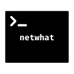
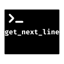

<table>
<tr>
  
<th align="center">

Project

</th>
  
<th align="center">

Subject

</th>
  
<th align="center">

Object

</th>
  
<th align="center">

Score

</th>
</tr>
  
<tr>
<td align="center"> <a href="https://github.com/romanbtt/42_cursus/tree/main/libft"> <a/> </td>
<td align="center">   </td>
<td align="center">This project is your very first project as a student at 42. You will need to recode a few functions of the C standard library as well as some other utility functions that you will use during your whole cursus. </td>
<td align="center"> <a href=#> <a/></td>
</tr>
  
<tr>
<td align="center"> <a href=#><a/></td>
<td align="center">   </td>
<td align="center">Netwhat will allow you to discover the network and to understand how it works. This will allow you to understand how some things you already use in your everyday life, without even knowing it. For that you will answer a questionnaire on the website netwhat.42.fr. If you unregister this project, you will need to wait three days before you can retry the subject. </td>
<td align="center"> </td>
</tr>

<td align="center"> <a href=#><a/></td>
<td align="center">   </td>
<td align="center">May it be a file, stdin, or even later a network connection, you will always need a way to read content line by line. It is time to start working on this function, which will be essential for your future projects. </td>
<td align="center"> </td>

</table>
