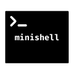
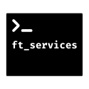
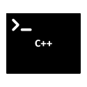
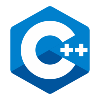

<table>
  
<th align="center">

Project

</th>

<th align="center">

Language

</th>
 
 
<th align="center">

Description

</th>
 
  
<tr>
<td align="center"><a href=#> <a/> </td>
<td align="center"><a href=#><a/></td>
<td align="center">The aim of this project is to code a C library regrouping common functions that are going to be used in other projects.</td>
</tr>

<tr>
<td align="center"><a href=#><a/></td>
<td align="center"><a href=#><a/></td>
<td align="center">This project is an introduction to network problematics.</td>
</tr>
  
<tr>
<td align="center"><a href=#><a/></td>
<td align="center"><a href=#><a/></td>
<td align="center">The aim of this project is to make a function that returns a line ending with a newline, read from a file descriptor.</td>
</tr>
 
<tr>
<td align="center"><a href=#><a/></td>
<td align="center"><a href=#><a/></td>
<td align="center">This project is pretty straight forward. It is about recoding "printf". The main goal is to learn how to use variadic arguments.</td>
</tr>
  
<tr>
<td align="center"><a href=#><a/></td>
<td align="center"><a href=#><a/></td>
<td align="center">This is a System Administration subject. The main goal is to discover Docker and set up a web server.</td>
</tr>

<tr>
<td align="center"><a href=#><a/></td>
<td align="center"><a href=#><a/></td>
<td align="center">This project is inspired by the world-famous eponymous 90’s game, which was the first FPS ever. It will enable you to explore ray-casting. The goal is to discover the ray-casting algorithm and allowing to make a dynamic view inside a maze.</td>
</tr>
  
<tr>
<td align="center"><a href=#><a/></td>
<td align="center"><a href=#><a/></td>
<td align="center">The aim of this project is to get familiar with assembly language. </td>
</tr>
  
<tr>
<td align="center"><a href=#><a/></td>
<td align="center"><a href=#><a/></td>
<td align="center">The objective of this project is to create a simple shell.</td>
</tr>
  
<tr>
<td align="center"><a href=#><a/></td>
<td align="center"><a href=#><a/></td>
<td align="center">This project consist to clusturing an docker-compose application and deploy it with Kubernetes. </td>
</tr>
  
<tr>
<td align="center"><a href=#><a/></td>
<td align="center"><a href=#><a/></td><a/>
<td align="center">This project involves sorting data on a stack, with a limited set of instructions, and the smallest number of moves.</td>
</tr>
  
 <tr>
<td align="center"><a href=#><a/></td>
<td align="center"><a href=#><a/></td><a/>
<td align="center">Introduction to multithreading programming with the famous problem of the dinner of the philosophers.</td>
</tr>
  
<tr>
<td align="center"><a href=#><a/></td>
<td align="center"><a href=#><a/></td><a/>
<td align="center">This piscine C++ is about to learn the language and the concepts of Object-oriented programming.</td>
</tr>
  
</table>
